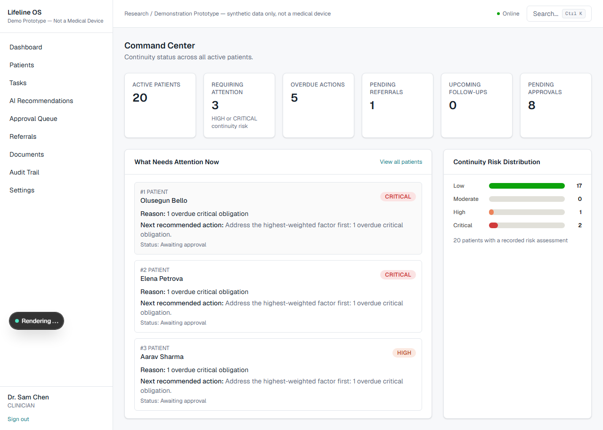
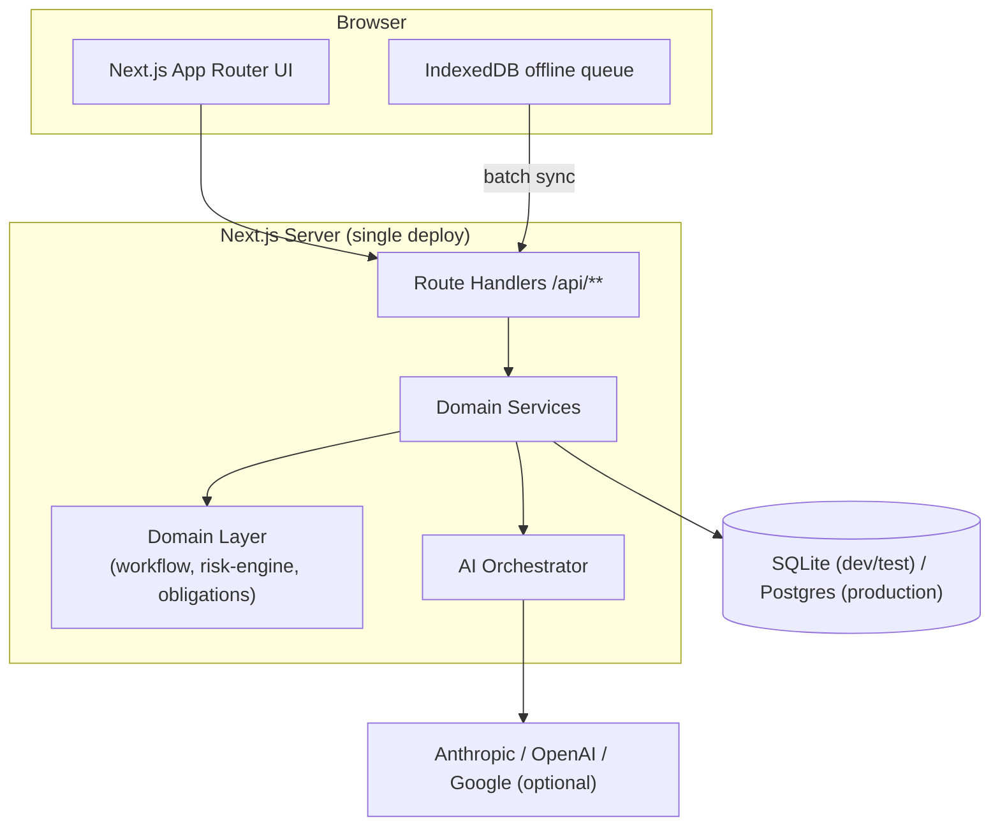
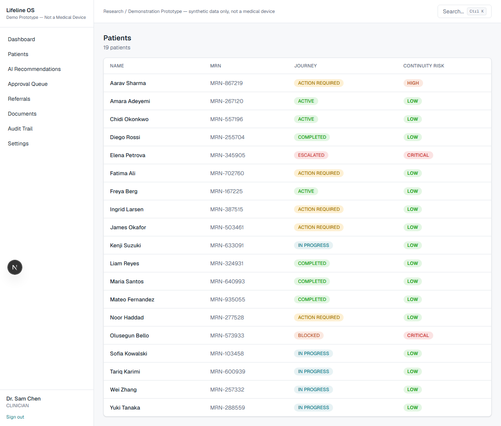
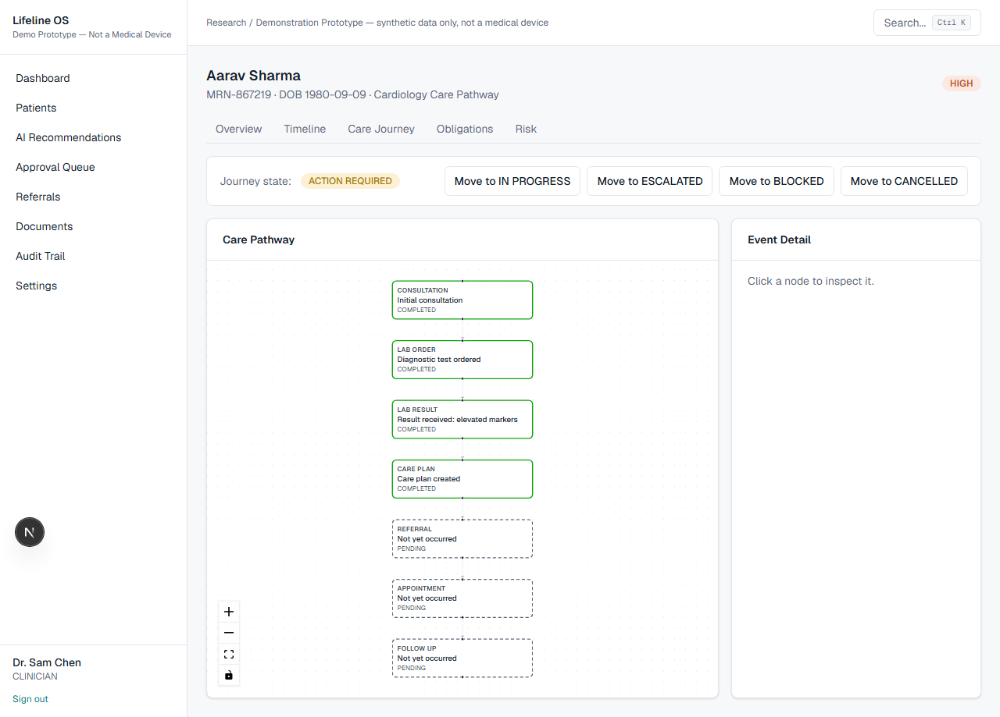
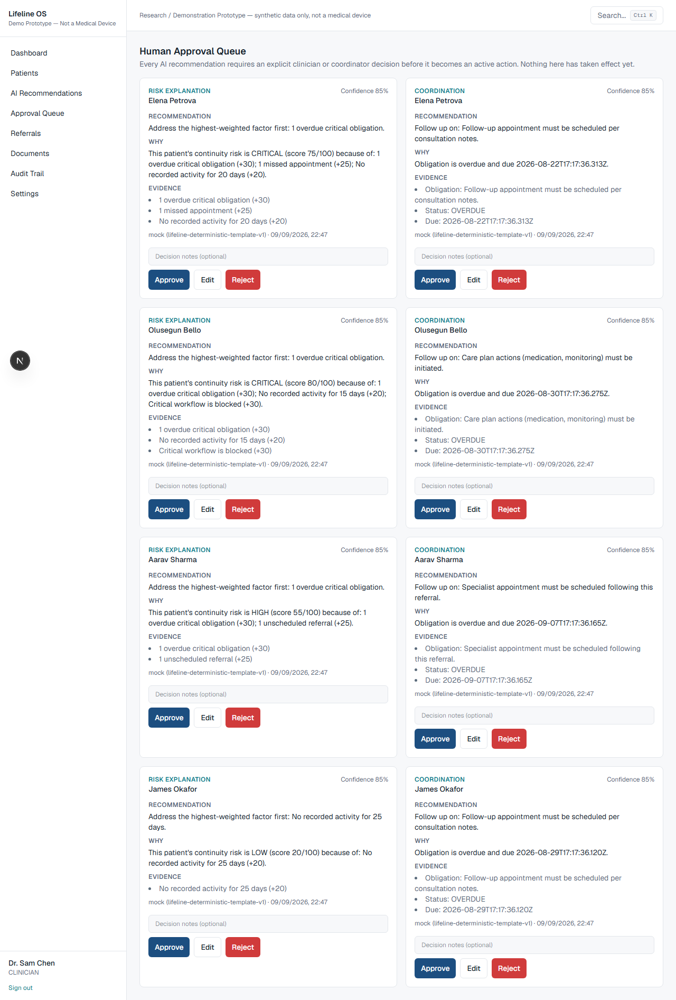
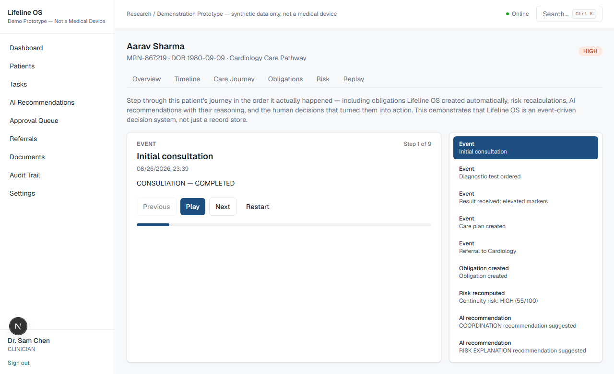
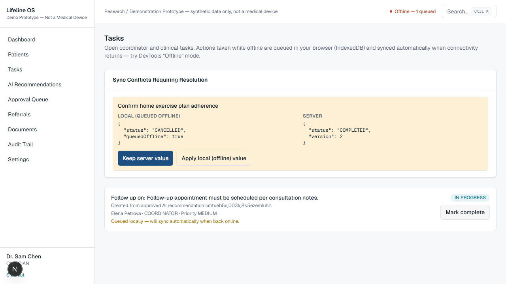

# Lifeline OS

### The intelligent continuity layer for healthcare.

> **Research / Demonstration Prototype — Not a Medical Device.** All data
> in this repository is synthetic. See [Disclaimer](#disclaimer).



## Problem

Healthcare interactions are fragmented. A patient visits a doctor,
receives a prescription, gets referred for a test or a specialist, and
then the connective tissue between those events — *what has to happen
next, and who is responsible for it* — lives nowhere. A referral sits
unscheduled. A follow-up gets missed. A document arrives and nobody
reviews it. Each individual event is usually recorded somewhere, but no
system understands the patient's *entire* care journey well enough to
notice the gap before it becomes a missed diagnosis or a preventable
readmission.

## Solution

Lifeline OS builds a living **care continuity graph** for every patient
and continuously answers nine questions: what happened, what's happening,
what should happen next, what's missing, is this patient at risk of
falling out of their care pathway, what should be prioritized, why, what
evidence supports that, and does a human need to approve it before it
happens.

It does this with a **deterministic workflow and risk engine** at the
core — not an LLM guessing at urgency — and an **AI layer** that only
explains, summarizes, drafts, and organizes, never diagnoses or acts
unilaterally. Every AI recommendation sits in an approval queue until a
clinician or coordinator explicitly decides on it.

## Why existing systems fall short

EHRs record what happened. Task managers track what's assigned. Neither
connects the two: an EHR doesn't know that a referral it stored three
weeks ago should have produced an appointment by now, and a task manager
doesn't know *why* a task matters clinically. Lifeline OS's obligation
engine (`src/domain/obligations.ts`) exists specifically to close that
gap — every care event that implies a future responsibility (a referral
implies "schedule this," a lab order implies "complete this test")
automatically creates an explicit, trackable, prioritized obligation, and
the risk engine watches those obligations for signs a patient is falling
through the cracks.

## Core capabilities

- **Care Continuity Graph** — a visual, click-to-inspect pathway per
  patient (React Flow), built from real event/obligation data, not a
  static diagram.
- **Continuity Engine** — obligations derived automatically from care
  events, with due dates, priority, and ownership.
- **Risk Engine** — a deterministic, configurable, fully explainable
  scoring model (0–100, LOW/MODERATE/HIGH/CRITICAL) — see
  [`docs/domain-model.md`](docs/domain-model.md).
- **AI Orchestrator** — six agents behind a provider-agnostic abstraction
  (Anthropic/OpenAI/Google/Mock) with automatic fallback and strict
  output validation — see [`docs/ai-architecture.md`](docs/ai-architecture.md).
- **Human Approval** — nothing an AI agent suggests takes effect until a
  clinician or coordinator explicitly approves, edits, or rejects it.
- **Offline Sync** — an IndexedDB-backed action queue with idempotent
  replay and real conflict detection/resolution — see
  [`docs/offline-sync.md`](docs/offline-sync.md).
- **Audit Trail** — append-only, actor-attributed, for every consequential
  action.
- **Care Pathway Replay** — step through a patient's entire journey in the
  order it happened, including the system's reasoning at each stage.

## Architecture



Full diagrams, the event-driven pipeline, and — importantly — an honest
note on why this is one Next.js deployment rather than the
Next.js+FastAPI+Postgres+Redis split described in the original brief, are
in [`docs/architecture.md`](docs/architecture.md).

## Screenshots

| | |
|---|---|
|  Patients, with live continuity risk |  Care pathway graph, click-to-inspect |
|  Human approval queue — recommendation, why, evidence, confidence |  Care Pathway Replay stepping through cause and effect |
|  Offline action queued, syncs on reconnect | |

## Tech stack

Next.js 16 (App Router, TypeScript, Tailwind CSS 4) · Prisma 7 ·
SQLite (`better-sqlite3` driver adapter, dev/test) / PostgreSQL (documented
production path) · React Flow · a hand-built, colorblind-validated status
chart (no charting library — see `src/components/dashboard/RiskDistributionChart.tsx`)
· Zod · JWT sessions (`jose`) + `bcryptjs` · IndexedDB (`idb`) for offline
sync · Vitest + Playwright.

## Getting started

Requires Node.js 22+.

```bash
git clone <this repo>
cd lifeline-os
npm install --legacy-peer-deps   # see "Known issues" below for why
npm run db:setup                 # generate client, bootstrap schema, seed demo data
npm run dev
```

Open <http://localhost:3000>. No API keys, no external database, and no
`docker compose` are required to see the full product — the AI layer runs
entirely on a deterministic Mock provider by default.

`npm run db:setup` runs three steps you can also run individually:
`db:generate` (Prisma client), `db:bootstrap` (applies the schema to a
local SQLite file), `db:seed` (20 synthetic patients, including 7 named
scenarios — see below). **Stop the dev server before re-running
`db:reset`** — SQLite locks the file while a connection is open, and on
Windows the reset (which deletes the file) will fail if something still
has it open.

### With Docker (Postgres) — documented, not verified in this build

```bash
docker compose up
```

See [`docker-compose.yml`](docker-compose.yml) — this path requires the
Postgres migration steps noted in `docs/architecture.md` and has not been
run end to end in the environment this was built in (see "Known issues").

### Optional: real AI providers

```bash
# .env
AI_PROVIDER=anthropic   # or openai, google
ANTHROPIC_API_KEY=...
```

Any provider left unconfigured is simply skipped in the fallback chain;
the app never breaks for lack of a key. See
[`docs/ai-architecture.md`](docs/ai-architecture.md).

## Demo credentials

All synthetic, seeded by `prisma/seed.ts`, also shown on the login page:

| Role | Email | Password |
|---|---|---|
| Clinician | `clinician@lifeline.demo` | `LifelineDemo!Clinician1` |
| Coordinator | `coordinator@lifeline.demo` | `LifelineDemo!Coordinator1` |
| Admin | `admin@lifeline.demo` | `LifelineDemo!Admin1` |
| Patient (linked to Aarav Sharma) | `patient@lifeline.demo` | `LifelineDemo!Patient1` |

### The demo scenario

Seed data includes the showcase journey from the brief: **Aarav Sharma** —
consultation → diagnostic test → result → care plan → a cardiology
referral that's gone unscheduled past its window. Open his **Risk** tab
and click **Recompute risk & recommendations** to watch the continuity
engine flag it and generate an AI recommendation live; approve it from
**Approval Queue** to see it become a coordinator task; then visit his
**Replay** tab to step through the whole causal chain. Six more named
scenarios (healthy pathway, overdue follow-up, missing document, an
offline sync conflict, a blocked workflow, an escalated case) are seeded
alongside him — see `prisma/seed.ts`.

## API documentation

REST endpoints under `/api/**` — patients, timeline, care graph,
obligations, risk, events, referrals, appointments, tasks, the
recommendation approval queue, documents, offline sync, audit, dashboard
aggregates. Every route validates input with `zod`
(`src/domain/schemas.ts`) and returns the uniform shape
`{ error: { code, message } }` on failure. There is no separate OpenAPI
spec file in this build — the route handlers under `src/app/api/**` are
the source of truth; each is short enough to read directly.

## Testing

```bash
npm test              # unit + integration (Vitest)
npm run test:unit
npm run test:integration
npm run test:e2e       # Playwright — starts its own dev server
npm run evaluate       # scripts/evaluate.ts — see docs/evaluation.md
```

62 unit + integration tests and 4 end-to-end scenarios (matching the
brief's four named scenarios) were passing at the time of the last commit
in this repository — see [`docs/evaluation.md`](docs/evaluation.md) for
what's actually measured versus what is explicitly marked "not evaluated."

## Evaluation

[`docs/evaluation.md`](docs/evaluation.md) — every number in it comes from
actually running `scripts/evaluate.ts` or the test suites against this
code, not an estimate.

## Security

[`docs/security.md`](docs/security.md) — auth, authorization, input
validation, rate limiting, audit logging, and named gaps (e.g.,
authorization here is role-based, not patient/care-team-scoped).

## Threat model

[`docs/threat-model.md`](docs/threat-model.md) — a STRIDE table with a
mitigation and a residual risk for each entry, including prompt injection
and offline-sync replay.

## AI safety

Lifeline OS's AI layer never computes a risk score, never diagnoses, never
prescribes, and never executes a consequential action without an explicit
human decision — enforced architecturally (the functions that would do
those things simply don't exist in the AI layer), not just by prompt
instruction. Full detail in
[`docs/ai-architecture.md`](docs/ai-architecture.md).

## Roadmap

- Extend patient-scoped authorization's list-view filtering to the Tasks
  and Documents pages (acting on a specific item is already checked; see
  `docs/security.md`).
- A real event bus (the pipeline is currently direct function calls — see
  "Event bus" in `docs/architecture.md` for the exact seam to cut).
- Wire the three implemented-but-unused-in-UI agents (timeline,
  continuity, clinical-summary) into pages.
- Real PDF/binary document ingestion (this build accepts pasted text
  only).
- Verify the Postgres/Docker deployment path end to end.
- Evaluate against a real LLM provider, not just Mock.

## Limitations

Stated plainly, not buried:

- **Prisma Migrate could not be run natively** on the machine this was
  built on (a Windows Device Guard/WDAC policy blocks the schema-engine
  binary) — worked around with a hand-written, hand-applied migration SQL
  file. See `docs/architecture.md` for the full explanation and why this
  doesn't affect a normal environment.
- **SQLite, not Postgres**, is what has actually been run and tested. The
  Postgres path is documented but unverified.
- **Only the Mock AI provider has been exercised.** The Anthropic/OpenAI/
  Google providers are real, working implementations but have not been
  called against a live API in this build.
- **Document ingestion is text-paste only** — no PDF/binary file parsing.
- **Patient-scoped authorization covers every per-patient read/write path**
  (see `docs/security.md`), but the Tasks and Documents *list* views still
  show cross-patient metadata to any clinician/coordinator regardless of
  care-team membership — acting on a specific item is checked either way.
- **The in-memory rate limiter and AI-call log** don't persist across
  restarts or coordinate across multiple server instances.
- **Docker/docker-compose has not been run** in this environment (the
  Docker daemon wasn't available) — the Dockerfile and compose file are
  written but unverified.

## Disclaimer

> Lifeline OS is a research/demonstration prototype using synthetic data
> and is not a medical device or a substitute for professional medical
> judgment. It must never be pointed at real patient data, connected to a
> real EHR, or used to make an actual clinical decision. Every
> consequential action in this system requires explicit human clinician or
> coordinator approval — the AI layer explains, drafts, and organizes, and
> nothing more.

## License

[MIT](LICENSE).
