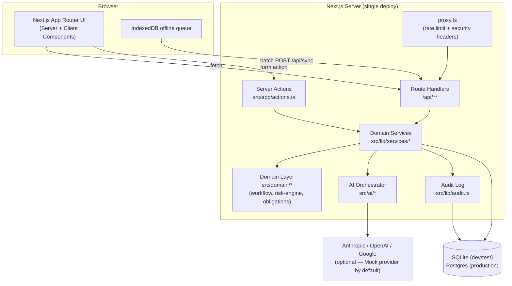
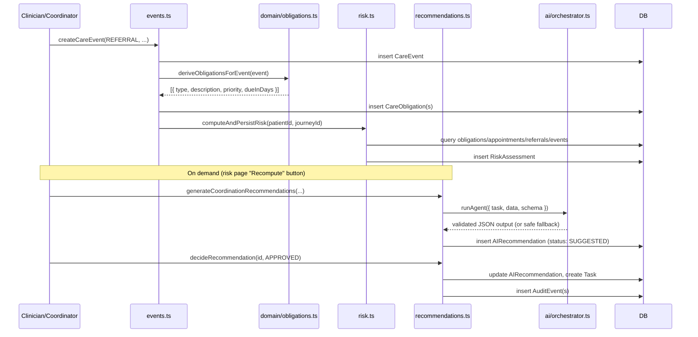

# Architecture

> Research / Demonstration Prototype — not a medical device.

## System diagram



## Why one deploy instead of Next.js + FastAPI + Postgres + Redis

The reference architecture in the brief splits the frontend, API, database,
and cache into four separate services. This build consolidates the frontend
and API into a single Next.js application (Route Handlers + Server Actions
sharing one service layer) for reasons specific to how this project was
actually built and needs to run:

- **It has to be genuinely runnable and testable in one command**, on a
  machine that turned out to have real constraints (see "Known environment
  limitation" below). A single deploy means `npm run dev` is the whole
  system — no service orchestration, no network boundary between "the API"
  and "the app" to get wrong.
- **The domain service layer (`src/lib/services/*`) is the actual API
  boundary.** Route Handlers under `src/app/api/**` are thin wrappers
  around it that exist so the system also exposes a conventional REST API
  (per the spec) and so an external client (mobile app, second frontend,
  `curl`) has something to call. Server Components and Server Actions call
  the same service functions directly, in-process, rather than making an
  HTTP round-trip to itself.
- **Redis isn't load-bearing for the demonstrated features.** The one place
  a real deployment would want it — the rate limiter in `src/proxy.ts` — is
  explicitly documented as an in-memory, per-instance stand-in.

If this were being taken toward a real multi-team deployment, the natural
next step is exactly the reference split: pull `src/domain` and
`src/lib/services` into a standalone API service (FastAPI or a separate
Next.js API-only deploy), point the existing frontend at it over HTTP
instead of in-process calls, and add Redis for rate limiting and the event
bus described below.

## Layers

```text
src/app/            Routes: pages (Server Components), API route handlers,
                     Server Actions (src/app/actions.ts)
src/domain/          Pure, dependency-free business rules: care-journey state
                     machine, continuity risk engine, obligation derivation
                     rules, zod schemas, typed errors. No I/O — this is what
                     tests/unit exercises directly.
src/lib/services/    Orchestrates domain logic against the database: creates
                     events, derives obligations, recomputes risk, runs AI
                     agents, applies human decisions, handles offline sync.
                     This is the real API surface (see above).
src/lib/             Cross-cutting: db client, auth, audit log, api-helpers,
                     sanitize (prompt-injection defense), format.
src/ai/              Provider abstraction, agents, orchestrator (see
                     ai-architecture.md).
src/offline/         Browser-side IndexedDB queue + sync manager (see
                     offline-sync.md).
src/components/      UI: reusable primitives (src/components/ui) and
                     feature components (src/components/dashboard).
prisma/              Schema, hand-applied migration SQL, seed script.
tests/               unit/, integration/, e2e/.
```

## Data flow: the event-driven pipeline



Obligation derivation and risk scoring are **plain deterministic
functions** (`src/domain/obligations.ts`, `src/domain/risk-engine.ts`) —
unit-tested directly with no database or AI involved. The AI layer only
ever explains or drafts text around numbers the rules engine already
computed; it never computes the risk score itself (see
`docs/ai-architecture.md`).

This is implemented as a straightforward in-process function chain, not a
message bus. `src/lib/services/events.ts`'s `createCareEvent` calls the
obligation and risk steps directly. This is intentionally the simplest
thing that satisfies the "event → obligation → risk" causality the spec
asks for; see "Event bus" below for what a production version would look
like instead.

## Event bus

The pipeline above is written as direct function calls, not pub/sub. This
was a deliberate scope decision (spec section 57: working core over
infrastructure) — for a single-process app, an in-memory event bus adds a
layer of indirection without a corresponding benefit yet. `src/ai/orchestrator.ts`
does keep one piece of real indirection: an in-memory ring buffer of recent
AI calls, structured the way a proper event log's entries would be, feeding
the observability page at `/settings`.

The natural place to introduce a real bus (Redis Streams, BullMQ, or
similar — see spec section 37) is exactly the seam already drawn: emit a
`CareEventCreated` event from `events.ts` instead of calling
`deriveObligationsForEvent`/`computeAndPersistRisk` inline, and let
obligation derivation, risk recomputation, and (eventually) automatic
recommendation generation subscribe to it as independent consumers. That
also removes the current constraint that recommendation generation is a
separate, explicit step (the risk-page "Recompute" action) rather than
automatic on every event.

## Known environment limitation: Prisma Migrate on this machine

This project was built on a Windows machine where a Device Guard/WDAC
policy blocks execution of Prisma's native `schema-engine-windows.exe` —
confirmed by direct invocation, not inferred. `prisma migrate dev`,
`db push`, and even schema-only `migrate diff` all fail with `spawn
UNKNOWN` because they shell out to that binary. Prisma's other native
piece, `better-sqlite3`, is a Node addon loaded in-process (not spawned as
a subprocess), so it works fine — that's the whole basis for the
workaround.

**Workaround in this repo:** `prisma/migrations/0001_init/migration.sql` is
hand-written (matching the schema, not machine-generated) and applied
directly via `better-sqlite3` in `prisma/bootstrap.ts` for local dev/test.
`npm run db:bootstrap` and the test suite's `tests/global-setup.ts` both use
this path.

**On any unrestricted machine** (Linux CI, Docker, macOS, a Windows box
without this policy), `npx prisma migrate dev` works normally and will pick
up the same `prisma/migrations/` directory as its history going forward —
nothing about the schema or migration file is workaround-specific, only how
it gets applied on this machine.

## Deployment target: SQLite now, Postgres for production

`prisma/schema.prisma` deliberately avoids Prisma's native `enum` type
(unsupported on SQLite) in favor of validated `String` columns
(`src/domain/types.ts` + `src/domain/schemas.ts`), so the schema itself is
portable. What differs between SQLite and Postgres is the driver adapter
and the `datasource.provider` value — see `docker-compose.yml` for a
Postgres service and the comment at the top of `prisma/schema.prisma` for
the exact steps to switch (`@prisma/adapter-pg`, change `provider =
"postgresql"`, update `src/lib/db.ts` and `prisma.config.ts`). This switch
has not been executed or tested in this build (no Postgres server was
available in this environment) — treat it as a documented, mechanically
straightforward next step, not a verified one.

## Failure boundaries

- **AI provider failure** never blocks a request: `src/ai/orchestrator.ts`
  falls back through every configured provider and finally to the
  deterministic Mock provider, which always succeeds (see
  `ai-architecture.md`).
- **Malformed AI output** never reaches the database: every agent response
  is schema-validated (`src/ai/prompt.ts#safeParseJson`); on failure the
  caller gets a safe, clearly-labeled fallback object instead.
- **Concurrent task edits** are caught by optimistic concurrency
  (`Task.version`), surfaced as `ConflictError` (HTTP 409) online, or as a
  `CONFLICT` sync operation offline (see `offline-sync.md`).
- **Invalid workflow transitions** are rejected before they reach the
  database (`src/domain/workflow.ts`), including terminal-state mutation,
  duplicate transitions, and out-of-order transitions.
- **API errors** always return the structured shape `{ error: { code,
  message } }` (`src/lib/api-helpers.ts`) — never a raw stack trace or an
  unstructured 500.
