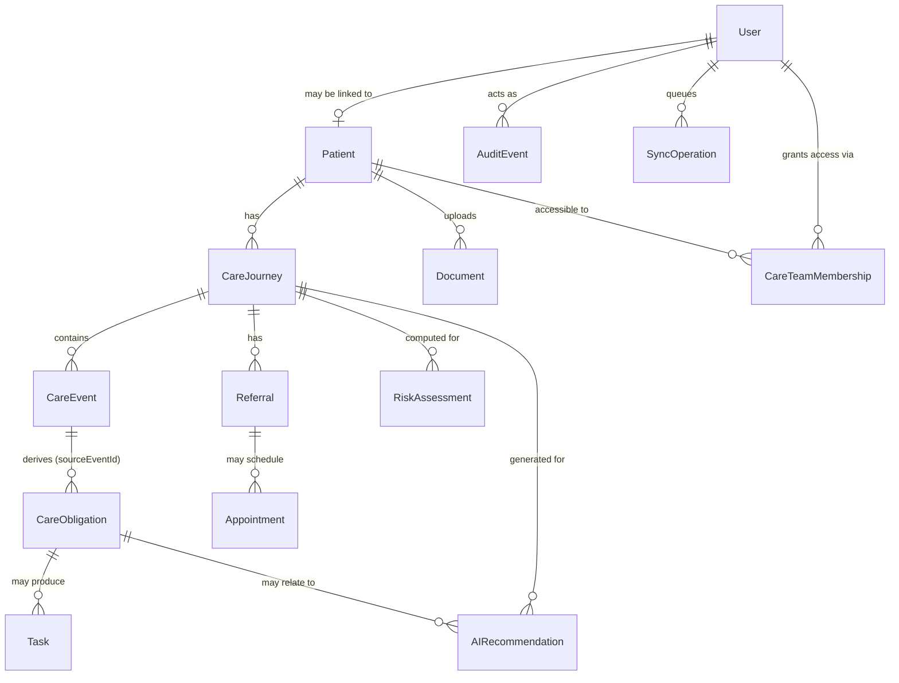

# Domain Model

## The core separation: facts, interpretations, recommendations, decisions

This is the single most important modeling decision in Lifeline OS (spec
section 36). Every table belongs to exactly one of these categories, and
the application code never blurs them:

| Category | What it means | Entities | Who/what writes it |
|---|---|---|---|
| **FACT** | Something that actually happened | `CareEvent`, `Referral`, `Appointment`, `Document` (raw upload) | Clinician/coordinator action, or a human validating an extraction |
| **INTERPRETATION** | A computed reading of the facts | `RiskAssessment` | The deterministic risk engine only — never an LLM |
| **RECOMMENDATION** | A suggested action, not yet real | `AIRecommendation` (status `SUGGESTED`) | An AI agent |
| **DECISION** | A human's ruling on a recommendation | `AIRecommendation` (status `APPROVED`/`REJECTED`/`EDITED`/`EXECUTED`) | A clinician or coordinator, recorded via `decidedById`/`decidedAt` |

`AIRecommendation` deliberately holds both the recommendation and its
eventual decision as one row rather than two tables (`Recommendation` +
`Approval`) — the decision fields (`status`, `decidedById`, `decidedAt`,
`decisionNotes`) are simply null until a human acts. This was a
simplification from the spec's separate `Approval` entity; the audit log
(`AuditEvent`, one row per `RECOMMENDATION_APPROVED`/`_REJECTED`/`_EXECUTED`
action) is what actually gives you the append-only decision history spec
section 21 asks for, so nothing is lost by not having a second table.

## Entities

### CareTeamMembership — patient-scoped authorization

Grants one `CLINICIAN`/`COORDINATOR` user access to one patient
(`userId` + `patientId`, unique together). `src/lib/authorization.ts#requirePatientAccess`
checks this table for those two roles; `PATIENT`-role access is instead
scoped via `Patient.userId`, and `ADMIN` is unrestricted. `createPatient`
auto-creates the membership for its `CLINICIAN`/`COORDINATOR` creator, so
the person who just created a patient doesn't immediately fail their own
next request to view it. See `docs/security.md` "Authorization" for the
full enforcement picture (every patient-scoped service function checks
this itself, not just the routes that call it).

### CareJourney — the state machine

States: `CREATED, ACTIVE, ACTION_REQUIRED, IN_PROGRESS, BLOCKED, ESCALATED,
COMPLETED, CANCELLED`. `COMPLETED` and `CANCELLED` are terminal — every
transition out of them is rejected. Valid transitions are an explicit table
in `src/domain/types.ts` (`JOURNEY_TRANSITIONS`), validated by
`src/domain/workflow.ts#validateJourneyTransition`, which is what
`tests/unit/workflow.test.ts` exercises directly (valid transition,
terminal-state mutation, duplicate transition, out-of-order transition —
the four cases the spec calls out). The update itself is a compare-and-swap
(`updateMany({ where: { id, state: from } })`, not a plain `update`) so two
concurrent transitions starting from the same state can't silently
clobber one another — see `tests/integration/journey-concurrency.test.ts`.
Landing on a terminal state also auto-cancels any obligation on that
journey still `OPEN`/`IN_PROGRESS`/`OVERDUE` (`CANCELLED`, not
`COMPLETED` — closing the journey doesn't mean the obligation was
fulfilled, just that it's moot now), so a closed pathway doesn't keep
contributing overdue-obligation weight to its own risk score; see
`tests/integration/journey-terminal-state.test.ts`.

### CareEvent — a fact

`type` is one of `CONSULTATION, LAB_ORDER, LAB_RESULT, CARE_PLAN, REFERRAL,
APPOINTMENT, MEDICATION, FOLLOW_UP, DOCUMENT, TASK, AI_EVENT`. Creating one
is the trigger for the obligation-derivation step (see below).

### CareObligation — "something must happen"

Not a status field bolted onto an event — a first-class row with its own
lifecycle (`OPEN → IN_PROGRESS → COMPLETED`, or `→ OVERDUE`/`CANCELLED`/
`ESCALATED`), `priority`, `dueAt`, and `assignedTo`. Always traces back to
the `CareEvent` that created it via `sourceEventId`. Derivation rules live
in `src/domain/obligations.ts` — a plain lookup table from event type (plus
metadata, e.g. `CONSULTATION` only produces a follow-up obligation if
`metadata.followUpRequired` is set) to an obligation template. Overdue
promotion (`OPEN`/`IN_PROGRESS` past `dueAt` → `OVERDUE`) happens lazily on
risk computation (`src/lib/services/risk.ts#promoteOverdueRecords`) rather
than via a background job — see the note in that file and in
`architecture.md`.

### RiskAssessment — the deterministic interpretation

Never written directly by a user or an AI agent — always produced by
`computeContinuityRisk` (`src/domain/risk-engine.ts`) from a `RiskSignals`
object that `src/lib/services/risk.ts` extracts from real data:
overdue obligations by priority, missed appointments, referrals pending
past a threshold, missing-document obligations, inactivity days, and
whether the journey is `BLOCKED`. See `docs/evaluation.md` for exactly
which of these are backed by real data versus structurally supported but
not yet fed by a modeled entity (`repeatedFailedContactCount` — there is no
`ContactAttempt` entity in this build).

### AIRecommendation — recommendation + decision

`agentType` is one of `TIMELINE, CONTINUITY, RISK_EXPLANATION,
COORDINATION, COMMUNICATION, CLINICAL_SUMMARY` (matching the six agents in
`src/ai/agents/`). `evidence` is a JSON array of plain strings pulled from
the actual obligation/risk data that prompted the recommendation — every
recommendation shown in the UI traces back to concrete evidence, never a
bare "AI thinks this patient is at risk."

### Task — the executed action

Created only when a `COORDINATION` recommendation is approved
(`src/lib/services/recommendations.ts#executeRecommendation`) — never
directly by an AI agent. Carries an integer `version` for optimistic
concurrency, used identically by the synchronous online path
(`services/tasks.ts#updateTaskStatus`) and the offline sync path
(`services/sync.ts`).

### Document — untrusted input, quarantined until validated

`status` moves `UPLOADED → EXTRACTED → VALIDATED`/`REJECTED`.
`rawTextSanitized` and `extractedFields` are never trusted directly — a
`CareEvent` is only created from a document once a human calls
`validateDocument` (see `docs/security.md` and `docs/ai-architecture.md`
for the prompt-injection handling in between).

### AuditEvent — append-only

One row per consequential action: `actorId`, `actorRole`, `action`,
`entityType`/`entityId`, `previousState`/`newState`, `reason`,
`requestId`, `createdAt`. `src/lib/audit.ts` exposes only `recordAudit` —
there is deliberately no update or delete function in that module, so the
log's immutability is enforced by the module's public surface, not just a
convention.

### SyncOperation — the offline queue's server-side record

`operationId` is a client-generated UUID and the table's unique key —
that's the entire idempotency mechanism (see `docs/offline-sync.md`).
`syncStatus` is `PENDING → APPLIED`/`CONFLICT`/`REJECTED`.

## What's intentionally not a separate entity

- **Approval** — folded into `AIRecommendation` (see above).
- **ContactAttempt** — the risk engine's `repeatedFailedContactCount`
  signal is real and tested, but nothing in this build writes to it; there
  is no messaging-attempt tracking entity yet.
- **Notification** — the table exists in the schema (matching the spec's
  entity list) but nothing currently writes to it; no notification delivery
  is implemented in this build.
