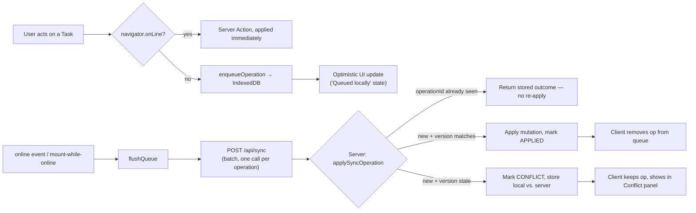

# Offline Synchronization

## Why

Coordinators and clinicians using Lifeline OS in the field (a home visit, a
facility with unreliable WiFi) need to be able to acknowledge and update
tasks without a live connection, and trust that those actions apply
correctly — exactly once — once connectivity returns, even if another user
changed the same record in the meantime.

## Architecture

- **Client queue**: `src/offline/db.ts` — an IndexedDB object store
  (`syncQueue`, via the `idb` library) keyed by `operationId`. Each entry:
  `{ operationId, entityType, entityId, operationType, payload,
  baseVersion, createdAt, retryCount, syncStatus }`.
- **Sync manager**: `src/offline/sync-manager.ts#flushQueue` — batches every
  `QUEUED` operation into one `POST /api/sync` call, then updates each
  entry's local status from the server's per-operation result. A network
  failure mid-flush leaves operations `QUEUED` (with `retryCount`
  incremented) rather than losing them.
- **Provider**: `src/offline/OfflineProvider.tsx` — a React context tracking
  connectivity via `useSyncExternalStore` (see "A real bug this caught"
  below), exposing `isOnline`, `queuedCount`, `conflictCount`, and
  `queueTaskUpdate()` to any client component. Flushes on the `online`
  event *and* on mount if already online with a non-empty queue (covers a
  browser closed mid-offline that never sees a fresh transition).
- **Server**: `src/lib/services/sync.ts#applySyncOperation` — the
  idempotency and conflict-detection logic (see below), backed by the
  `SyncOperation` table.

## Idempotency

`SyncOperation.operationId` is `@unique` in the schema and is the entire
mechanism: `applySyncOperation` checks for an existing row with that id
first and, if found, returns its **stored** outcome without touching the
underlying `Task` again. A dropped HTTP response and a client retry with
the same `operationId` therefore can never double-apply.
`tests/integration/sync.test.ts` proves this directly: the same
`operationId` submitted twice results in exactly one `SyncOperation` row
and a `Task.version` incremented exactly once, not twice.

## Conflict detection

Every queued Task operation carries `baseVersion` — the `Task.version` the
client last knew about. On apply:

- If `baseVersion` doesn't match the server's current `Task.version`, the
  operation is marked `CONFLICT` and `conflictDetails` stores `{ local,
  server }` — the queued change and the current server state, side by
  side. **Nothing is overwritten.**
- Otherwise the mutation applies exactly like the online path
  (`services/tasks.ts#updateTaskStatus`), which is itself
  optimistic-concurrency-checked (`WHERE id = ? AND version = ?`).

`baseVersion` is **required** for an `UPDATE_STATUS` operation, not merely
checked when present — `applyToEntity` (`src/lib/services/sync.ts`)
rejects one that omits it with a `ValidationError` (surfaces as a
`REJECTED` sync result) rather than falling back to comparing the
server's version against itself, which would trivially "match" and
silently skip conflict detection entirely. This was a real bug, fixed
during a later hardening pass — the real client always includes it, so it
was never reachable through the UI, but nothing stopped a direct API
request from omitting it before the fix.

This is the same mechanism online and offline: a same-tab double-click
race is caught by the identical version check that catches an offline
queue clashing with an online edit. `tests/integration/sync.test.ts`
covers a stale-version conflict and a same-entity race between two
distinct `operationId`s.

## Conflict resolution UI

`/tasks` (`src/components/dashboard/ConflictPanel.tsx`) lists every
`SyncOperation` still in `CONFLICT` status, showing the local (queued)
value and the server value side by side, with **Keep server value** /
**Apply local (offline) value** actions
(`resolveConflictAction` → `services/sync.ts#resolveConflict`). The seeded
"Patient E" (Wei Zhang) scenario ships with a real conflict pre-populated
so this is visible without having to manufacture one — see
`prisma/seed.ts` and `tests/e2e/scenario4-conflict-resolution.spec.ts`.

## A real bug this caught

`isOnline` was originally read via `useState(() => navigator.onLine)` (a
lazy initializer). A Playwright-driven smoke test caught a genuine React
hydration mismatch from this: the server has no `navigator` at all, and
the *real* client value at hydration time can legitimately differ from
whatever default is assumed. The fix uses `useSyncExternalStore` — the
React-sanctioned pattern for exactly this class of external, mutable
browser state — which renders a consistent `getServerSnapshot()` value
through hydration and only switches to the live value in a subsequent
client render. See the comment in `src/offline/OfflineProvider.tsx` and
the commit that introduced the fix for the full trace.

## What's verified vs. not

**Verified** (Playwright, `context.setOffline()`, both as an ad hoc driver
script during development and as `tests/e2e/scenario3-offline-sync.spec.ts`):
approve a recommendation → task appears → go offline → acknowledge (queued,
optimistic UI update, header shows "Offline — N queued") → reconnect →
reload → task lands as `IN_PROGRESS`, header shows "Online", zero console
errors.

**Not verified**: multi-tab conflict scenarios beyond the seeded one,
IndexedDB behavior under storage-quota pressure, and behavior in a private/
incognito window where IndexedDB can throw on open (the provider catches
this and degrades to "queueing unavailable" rather than crashing, per the
try/catch in `OfflineProvider.tsx#refresh`, but this specific path hasn't
been exercised by an automated test).
